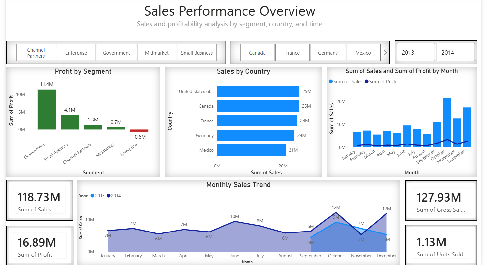

# 📊 Sales Performance Dashboard
### Power BI | Data Visualization | Business Insights  

---

## 🚀 Project Overview

This project presents an interactive **Sales Performance Dashboard** built using Power BI to analyze business performance across multiple dimensions including **segments, regions, and time**.

The dashboard is designed to provide **actionable insights into sales trends, profitability, and operational performance**, enabling data-driven decision-making.

---

## 🎯 Key Objectives

- Analyze sales and profitability across different customer segments  
- Track performance across countries and regions  
- Monitor monthly sales and profit trends  
- Identify business opportunities and inefficiencies  

---

## 📸 Dashboard Preview

---

## 📌 Key Features

### ✅ KPI Monitoring
- Total Sales  
- Total Profit  
- Units Sold  
- Gross Sales  

---

### ✅ Interactive Filtering
- Segment-based filtering (Enterprise, Midmarket, Small Business, etc.)  
- Country selection (Canada, Germany, France, Mexico)  
- Time filtering (Year-wise comparison)  

---

### ✅ Data Visualization

- **Bar Chart:** Profit by Segment  
- **Horizontal Bar Chart:** Sales by Country  
- **Line/Column Chart:** Monthly Sales & Profit Trend  
- **KPI Cards:** High-level business overview  

---

## 📈 Key Insights

- Government and Small Business segments contribute the highest profits  
- Enterprise segment shows negative profitability, indicating inefficiencies  
- Peak sales observed in Q4 (October–December)  
- Certain regions consistently outperform others in revenue generation  

---

## 🛠 Tools & Technologies

- Power BI  
- Data Modeling  
- DAX (Basic Measures & Calculations)  
- Data Visualization & Dashboard Design  

---

## 🧠 Business Value

- Enables quick identification of high-performing and underperforming segments  
- Supports strategic decision-making through visual insights  
- Helps businesses monitor trends and optimize operations  
- Improves reporting efficiency and clarity  

---

## 📁 Project Structure

powerbi-sales-dashboard/
│
├── dashboard.png
├── Sales_Dashboard.pbix
└── README.md

---

## 🔮 Future Improvements

- Add advanced DAX measures (YoY growth, rolling averages)  
- Integrate real-time data sources  
- Enhance UI with consistent theme and design system  
- Deploy dashboard to Power BI Service for live access  

---

## 👨‍💻 Author

**Arbaaz Shaikh**  
Data Analyst | SQL | Python | Power BI | ERP Systems  

---

## ⭐ Notes

- This project uses a sample dataset for demonstration purposes  
- Designed to showcase data visualization and analytical skills  

---